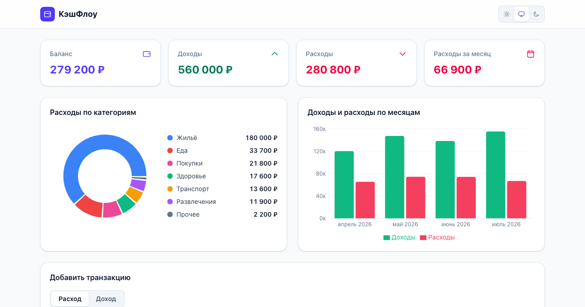
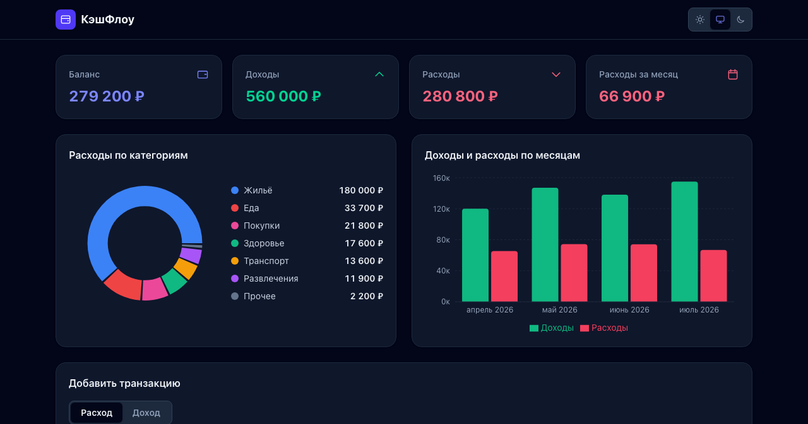

# КэшФлоу — трекер личных расходов

Дашборд личных финансов: визуализация трат, учёт транзакций и три темы оформления.
Одностраничное приложение на React с сохранением данных в браузере.

> Демо-проект для портфолио. Данные демонстрационные.

**🔗 Живая демонстрация:** https://expense-dashboard-eight-amber.vercel.app

| Светлая тема | Тёмная тема |
|---|---|
|  |  |

## Возможности

- **KPI-показатели:** баланс, доходы, расходы, расходы за текущий месяц
- **Графики (Recharts):** расходы по категориям (донат) и динамика по месяцам
- **Учёт транзакций:** добавление, редактирование, удаление
- **Фильтры и сортировка:** по типу, категории, периоду; сортировка по дате и сумме
- **Экспорт в CSV** текущего отфильтрованного списка
- **Три темы:** светлая, тёмная и системная — с сохранением выбора
- **Хранение в localStorage:** данные не теряются при перезагрузке
- Адаптивная вёрстка от 375px до десктопа

## Архитектура и качество

- Бизнес-логика (расчёты, агрегации, фильтры, CSV) вынесена в чистые функции
  и покрыта модульными тестами — компоненты только отображают данные
- **26 тестов** (Vitest): расчёты, экспорт, стор, валидация формы
- Управление состоянием — Zustand с persist-мидлварой
- Lighthouse (десктоп): **Performance 100 · Accessibility 100 · Best Practices 100**

## Стек

Vite, React, TypeScript, Tailwind CSS, Zustand (persist), Recharts, Vitest. Деплой на Vercel.

## Запуск

```bash
npm install
npm run dev
```

## Сборка и тесты

```bash
npm run build
npm test
```
